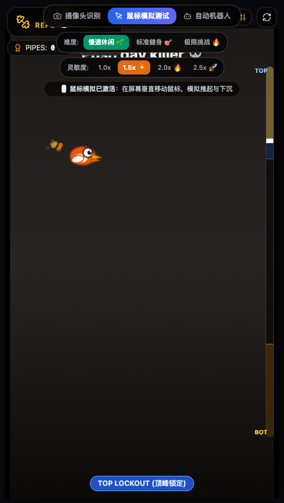
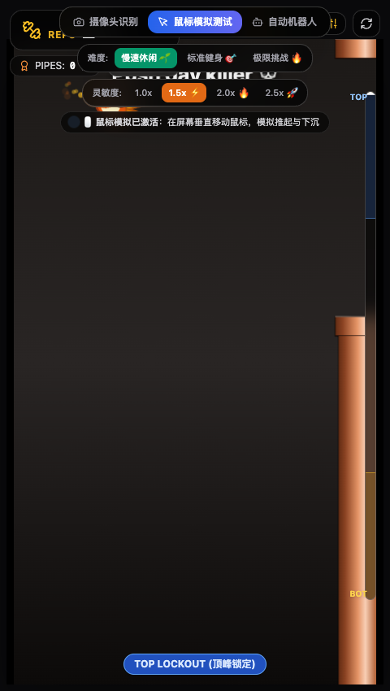
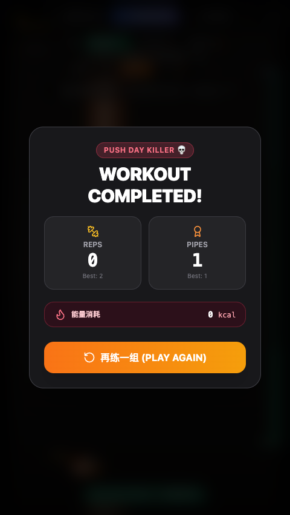
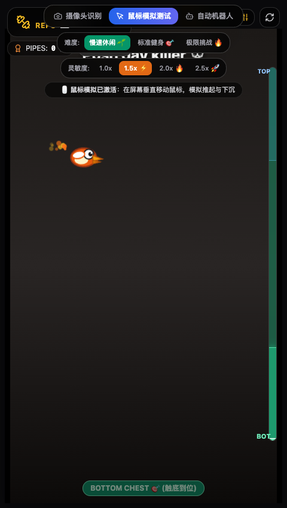

# Push-Up Flappy Bird (俯卧撑小鸟) 💀 Push Day Killer

<div align="center">


**把 Flappy Bird 和俯卧撑结合起来，健身突然有了通关的动力！**  
*A Computer-Vision-Powered Fitness Exergaming App combining Push-Ups with Flappy Bird.*

[English Overview](#english-overview) | [中文说明](#中文说明) | [快速上手](#快速上手-getting-started) | [生物力学设计](#生物力学与动作状态机) | [移动端工程](#移动端原生工程-android--ios)

</div>

---

## 📸 界面预览 (Screenshots)

<div align="center">
  <table>
    <tr>
      <td align="center" width="50%">
        <b>🖱️ 桌面端鼠标模拟与深度检测</b><br/>
        
      </td>
      <td align="center" width="50%">
        <b>🎯 动作达标计数与管道穿行</b><br/>
        
      </td>
    </tr>
    <tr>
      <td align="center" width="50%">
        <b>💥 碰撞检测与体能训练报告</b><br/>
        
      </td>
      <td align="center" width="50%">
        <b>🔄 训练循环与重新开始</b><br/>
        
      </td>
    </tr>
  </table>
</div>

---

## ✨ 核心特性 (Features)

### 1. 3D 金属铜管视觉与 60 FPS 物理渲染循环
- **金属圆柱质感：** 真实复刻铜管渐变高光与法兰管道扣环，极具街机力量感。
- **动态小鸟物理：** 橙色萌趣小鸟带有翅膀扇动动画、大眼睛视线聚焦，根据起伏速度动态仰角/俯冲（-20° ~ +20°）。
- **实景相机背景：** 玩家前置摄像头实时镜像半透明叠加（透明度自由调节），背景自带暗角对比增强，锻炼时随时观察自身动作形态。
- **全息 HUD 瞄准镜：** 在面部鼻尖处实时渲染翠绿色动态微光锁定框（`[👃 鼻子已锁定]`），所见即所得。

### 2. 毫秒级极速人脸跟踪算法 (Pico Cascade)
- **0.28 毫秒极速推理：** 纯原生 TypeScript 实现的 Viola-Jones 决策树级联算法，无需加载沉重的 WASM 外部模型，零内存溢出风险。
- **彻底隔离撑地手臂：** 做俯卧撑时双手固定撑在地面，传统质心算法会被地面手臂拉扯导致动作迟钝。Pico 直接识别人脸五官结构，精准定位鼻尖，头部起伏毫秒级同步！
- **零延迟物理跟随：** 消除传统多层平滑缓冲，小鸟垂直高度与跟踪输出实现 1:1 即时同步。

### 3. 生物力学动作状态机 (Biomechanical FSM)
- **5 阶段动作防作弊：**
  $$\text{TOP} \to \text{DESCENDING} \to \text{BOTTOM} \to \text{ASCENDING} \to \text{TOP (+1 Rep)}$$
- **深度防作弊机制：**
  - 要求触底停留至少 $100\text{ms}$，拒绝浅层点头作弊。
  - 单次动作保护时间 $T_{\text{min}} = 1.0\text{s}$，有效过滤抽搐误报。
  - 实时卡路里消耗计算（约 $0.36\text{ kcal / rep}$）。

### 4. 多重交互模式
- **📷 摄像头识别 (Camera Vision)：** 面对前置摄像头做俯卧撑，实时跟踪鼻尖起伏。
- **🖱️ 鼠标模拟测试 (Mouse Mode)：** 桌面端专用！上下移动鼠标模拟推起与下沉，带 Smoothstep 运动加减速曲线，便于无摄像头测试。
- **🤖 自动机器人巡航 (Autonomous Bot)：** AI 自动分析迎面管道开口高度并平滑穿行，全自动动作演示。

### 5. Web Audio 纯代码音效合成器
- 无需依赖任何外部音频文件，零网络延迟：
  - 扇翅破空音效（Flap Whoosh）
  - 穿越管道得分铃声（Score Bell Ding）
  - 深度触底提示轻响（Depth Pip 880Hz）
  - 俯卧撑完成大三和弦（Triumphant Major Arpeggio C5-E5-G5-C6）
  - 碰撞金属撞击音效（Collision Thud）

---

## 🚀 快速上手 (Getting Started)

### 环境要求
- Node.js 18+
- npm / yarn / pnpm

### 1. 克隆与安装依赖
```bash
git clone https://github.com/ZhangZZds/push-up-birdfly.git
cd push-up-birdfly
npm install
```

### 2. 启动本地开发服务
```bash
npm run dev
```
打开浏览器访问 `http://localhost:5173`。

### 3. 生产打包
```bash
npm run build
```

### 4. 自动化端到端测试
```bash
node e2e/test_mouse_gameplay.mjs
```

---

## 📱 移动端原生工程 (Android & iOS)

基于 **Capacitor 6** 构建原生移动端外壳：

### Android 原生工程 (`android/`)
* **包名：** `com.antigravity.pushupbird`
* **权限配置：** 已在 `AndroidManifest.xml` 中配置前置相机权限及硬件加速。
* **编译与运行：**
  ```bash
  npm run build
  npx cap copy android
  npx cap open android
  ```

### iOS 原生工程 (`ios/`)
* **Xcode 工程：** `ios/App/App.xcodeproj`
* **权限配置：** 已在 `Info.plist` 中配置 `NSCameraUsageDescription`。
* **编译与运行：**
  ```bash
  npm run build
  npx cap copy ios
  npx cap open ios
  ```

---

## 🔬 生物力学与设计规范 (Design Spec)

关于俯卧撑运动行程、疲劳衰减曲线、管道生成周期等详细数值推导，请参阅：
📑 **[`game_design_spec.md`](game_design_spec.md)**

---

## 📄 开源许可证 (License)

本项目基于 [MIT License](LICENSE) 协议开源。
